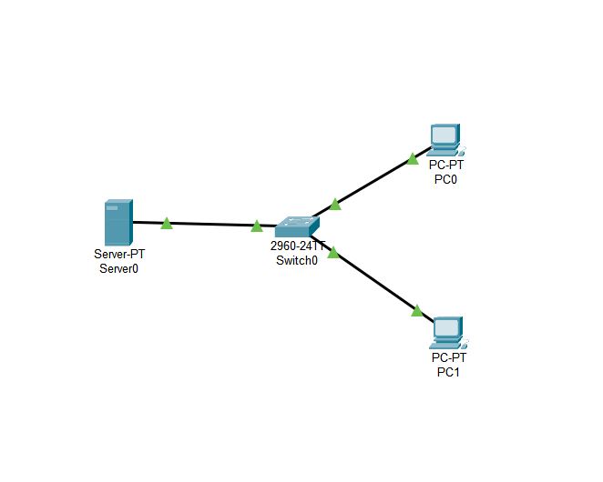
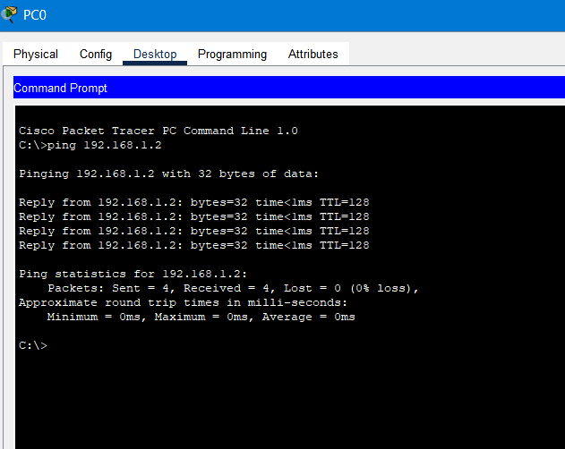

# Client-Server Network Lab – Cisco Packet Tracer

This project demonstrates a basic client-server architecture using Cisco Packet Tracer. A server provides DHCP services to two client PCs connected through a switch.

## 🧠 Objective

To simulate and configure a simple client-server network where:
- The server assigns IP addresses dynamically using DHCP.
- PCs receive IPs within the assigned subnet.
- Basic connectivity is tested using ping.

## 🖥️ Network Topology

- One DHCP server (`Server0`)
- Two client PCs (`PC0`, `PC1`)
- One switch connecting all devices (`Switch0`)

## ⚙️ Configuration Details

### Server (Static Configuration)
- IP Address: `192.168.1.2`
- Subnet Mask: `255.255.255.0`
- Default Gateway: `192.168.1.1`

### Server DHCP Settings
- Pool Name: `serverPool`
- Start IP Address: `192.168.1.5`
- Subnet Mask: `255.255.255.0`
- Default Gateway: `192.168.1.1`
- Max Users: `5`

### PC0 & PC1 (DHCP Assigned)

Both PCs are configured to obtain IP addresses automatically via DHCP from the server.

Example from `PC0`:
- IP Address: `192.168.1.5`
- Subnet Mask: `255.255.255.0`
- Default Gateway: `192.168.1.1`

## ✅ Connectivity Test

Ping test was run from `PC0` to the server’s static IP (`192.168.1.2`).

Result:
- All packets successfully received (0% loss)

## 💡 Notes

- Ensure DHCP service is turned **On** under Server > Services > DHCP.
- Set interface to `FastEthernet0` in the DHCP settings.
- Use the correct default gateway for your subnet.
- If a PC receives a `169.254.x.x` address, verify your DHCP configuration.

---

## 📁 Files Included

| File | Description |
|------|-------------|
| [Client Server Network.pkt](./Client%20Server%20Network.pkt) | Cisco Packet Tracer file |
| [pk1.png](./pk1.png) → [pk6.png](./pk6.png) | Screenshots of topology, configuration, and verification |
| [README.md](./README.md) | Documentation (this file) |
## 🔗 Author

Anthony Alston  
GitHub: [AnthonyAAlston](https://github.com/AnthonyAAlston)
